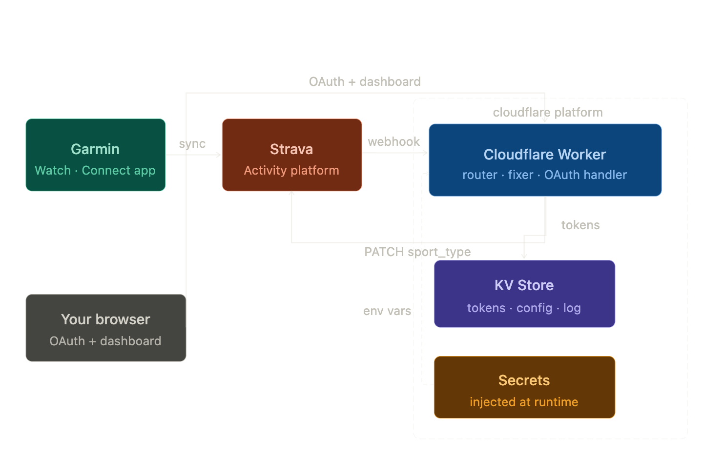

## About

Ever gone for a leisurely walk only for Strava to insist you were "Running" at a suspiciously slow pace? This Cloudflare Worker automatically detects slow "Runs" and re-types them as "Walks" (or your preferred activity type) the moment they are uploaded.

---

## How it Works

The system sits between your activity source (like a Garmin watch) and your Strava profile. It uses Webhooks to listen for new activities and instantly corrects them based on your settings.



### Logic
By default, the worker checks every new **Run** against two criteria:
1.  **Speed:** Is the average speed below **7.0 km/h**?
2.  **Keywords:** Does the activity title contain the word **"walk"**?

If either is true, the worker automatically updates the activity type on Strava.

---

## Features

*   **Real-time Corrections:** Uses Strava Webhooks to fix activities seconds after they appear.
*   **Web Dashboard:** A simple interface to manage settings, view logs, and connect/disconnect your account.
*   **Smart Token Management:** Automatically handles OAuth refreshing so you never have to log in twice.
*   **Customizable:** Adjustable speed thresholds and target activity types (e.g., change Runs to Hikes instead of Walks).

---

## Setup & Environment Variables

To run this worker, you'll need a [Strava API Application](https://www.strava.com/settings/api) and the following secrets configured in your Cloudflare environment:

| Secret | Description |
| :--- | :--- |
| `STRAVA_CLIENT_ID` | Your Strava App Client ID |
| `STRAVA_CLIENT_SECRET` | Your Strava App Client Secret |
| `AF_KV` | A Cloudflare KV Namespace bound to the worker |

---

## Project Structure

*   **`index.js`**: The core router and logic. It handles the webhooks, serves the dashboard, and manages the "Should I fix this?" decision-making.
*   **`strava.js`**: The API wrapper. It contains all the heavy lifting for OAuth flows, fetching activity details, and communicating with Strava's servers.
*   **`html.js`**: (Referenced) Contains the template for the web dashboard.

---

## Deployment

1.  Clone the repository.
2.  Configure your `wrangler.toml` with your KV binding.
3.  Deploy using Wrangler:
    ```bash
    wrangler deploy
    ```
4.  Visit your worker URL, connect your Strava account, and click **"Register Webhook"** in the dashboard.